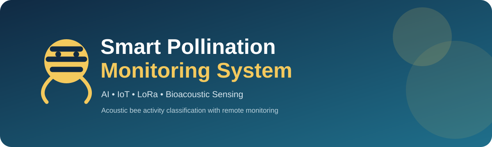
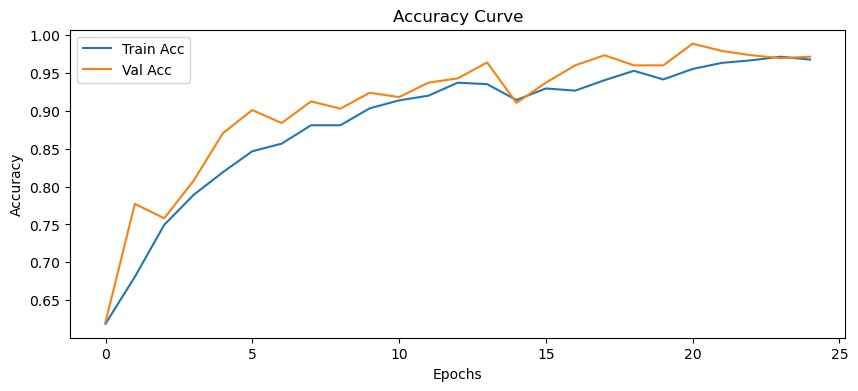
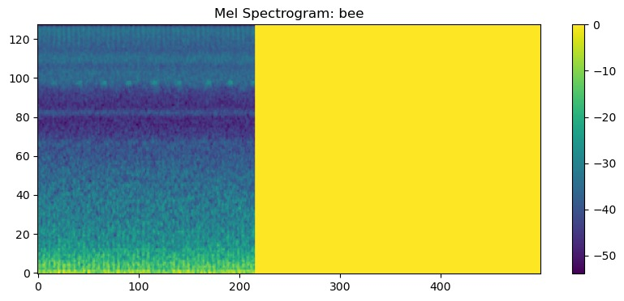
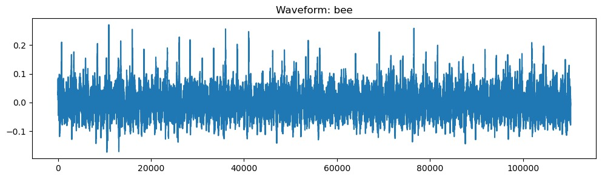
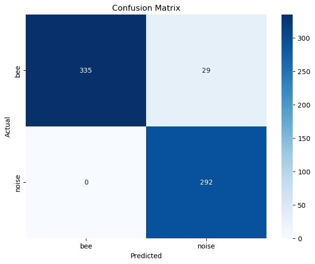
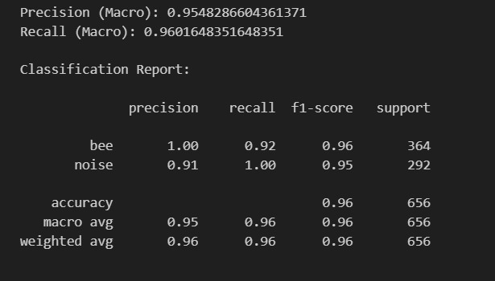
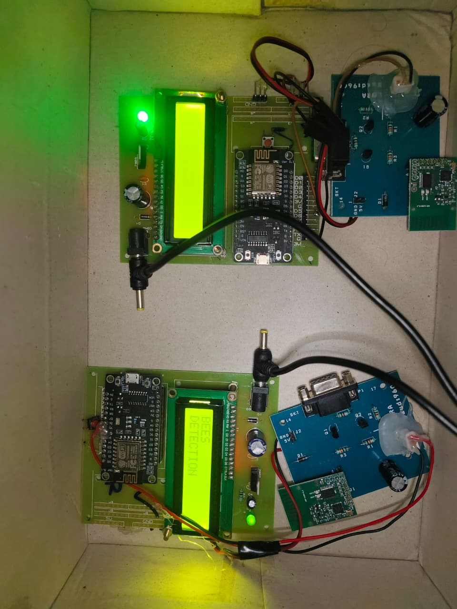
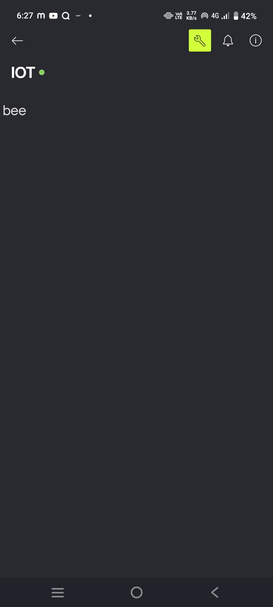
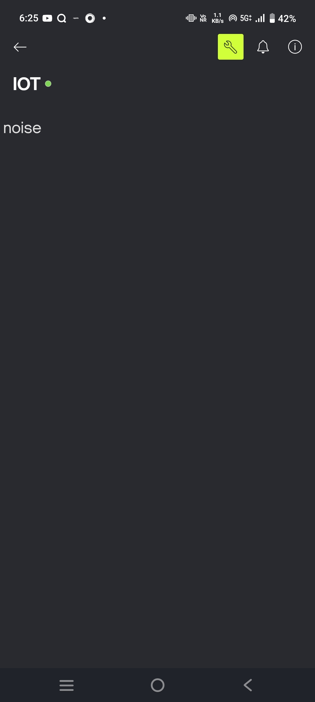

<div align="center">



# 🐝 Smart Pollination Monitoring System

### AI + IoT + LoRa + Bioacoustic Sensing

**A prototype for detecting bee activity from sound and reporting the result remotely.**


</div>

---

## 🌱 Why this project?

Continuous manual observation of bee activity is difficult in real field conditions. This project explores a practical sensing pipeline that converts **environmental sound → AI classification → wireless communication → remote monitoring**.

The prototype combines an **INMP441 MEMS microphone**, **ESP32**, **SX1278 LoRa**, a **CNN-based acoustic classifier**, and **Blynk** monitoring.

> **Core idea:** turn an acoustic event into a useful remote field observation.

---

## ⚡ At a glance

<table>
<tr>
<td align="center" width="25%"><b>🎙️</b><br/>Bioacoustic<br/>Sensing</td>
<td align="center" width="25%"><b>🧠</b><br/>CNN<br/>Classification</td>
<td align="center" width="25%"><b>📡</b><br/>LoRa<br/>Communication</td>
<td align="center" width="25%"><b>📱</b><br/>Blynk<br/>Monitoring</td>
</tr>
</table>

---

## 🔄 System workflow

```text
┌─────────────────────┐
│ INMP441 microphone  │
└──────────┬──────────┘
           │ audio
           ▼
┌─────────────────────┐
│ Audio preprocessing │
└──────────┬──────────┘
           │
           ▼
┌─────────────────────┐
│ Mel-spectrogram     │
│ 128 × 128           │
└──────────┬──────────┘
           │
           ▼
┌─────────────────────┐
│ CNN classifier      │
│ Bee / Noise         │
└──────────┬──────────┘
           │ class + confidence
           ▼
┌─────────────────────┐
│ SX1278 LoRa         │
└──────────┬──────────┘
           │ wireless packet
           ▼
┌─────────────────────┐
│ ESP32 receiver      │
└──────────┬──────────┘
           │
           ▼
┌─────────────────────┐
│ Blynk dashboard     │
└─────────────────────┘
```

---

# 🧠 Machine Learning

The supplied project evaluation contains the following visual results:

<div align="center">

<table>
<tr>
<td align="center"><b>Training / Validation Accuracy</b><br/><br/></td>
<td align="center"><b>Mel-Spectrogram</b><br/><br/></td>
</tr>
<tr>
<td align="center"><b>Audio Waveform</b><br/><br/></td>
<td align="center"><b>Confusion Matrix</b><br/><br/></td>
</tr>
</table>

</div>

### Model summary

- Input: Mel-spectrogram representation
- Mel bands: **128**
- Target representation: **128 × 128**
- Classes: **Bee Activity** and **Background Noise**
- CNN: three convolution stages followed by global average pooling and dense classification
- Optimizer: **Adam**
- Loss: **Sparse categorical cross-entropy**
- Default training: **25 epochs**, batch size **32**
- Train/validation split: **80/20**, random seed **42**

### 📈 Evaluation snapshot

The supplied classification output reports:

| Metric | Result |
|---|---:|
| Accuracy | **0.96** |
| Macro Precision | **0.9548** |
| Macro Recall | **0.9602** |
| Macro F1-score | **0.96** |
| Evaluation samples | **656** |

For the supplied confusion matrix, **335 bee samples** were correctly classified as bee and **292 noise samples** were correctly classified as noise; **29 bee samples** were classified as noise and **0 noise samples** were classified as bee.

> These values are presented as **results from the supplied project material**. They are not claimed as independently reproduced benchmarks.

### 🧪 Classification report

The original terminal result is preserved as a separate project artifact:



---

# 🔩 Hardware Prototype

The physical prototype is shown separately here rather than inside a crowded collage.

<div align="center">



<br/><br/>

<table>
<tr>
<td align="center"><b>ESP32</b><br/>Embedded controller</td>
<td align="center"><b>INMP441</b><br/>Digital MEMS microphone</td>
<td align="center"><b>SX1278</b><br/>LoRa communication</td>
<td align="center"><b>LCD</b><br/>Local classification display</td>
</tr>
</table>

</div>

### Hardware principle

The microphone captures the acoustic signal, the ESP32 handles embedded acquisition/control, and the SX1278 provides the wireless communication path. The prototype also demonstrates local classification output on the LCD.

> Exact GPIO assignments should be verified against the actual board variant and physical wiring before deployment.

---

# 📡 IoT / Blynk Monitoring

The supplied screenshots show the classification being sent successfully to the Blynk layer and displayed as **bee** or **noise**.

<div align="center">

<table>
<tr>
<td align="center"><b>🐝 Bee detection</b><br/><br/></td>
<td align="center"><b>〰️ Noise detection</b><br/><br/></td>
</tr>
</table>

</div>

The prototype console also shows repeated successful data transmission to Blynk during testing.

### Monitoring concept

```text
CNN prediction
      ↓
class + confidence
      ↓
LoRa / ESP32 communication
      ↓
Blynk update
      ↓
Remote observation
```

> **Security:** never commit Blynk authentication tokens, Wi-Fi passwords, or other credentials. Store them in local configuration or environment variables.

---

# 🧩 Technology Stack

| Layer | Technology | Purpose |
|---|---|---|
| Acoustic sensing | INMP441 | Capture environmental audio |
| Embedded | ESP32 | Acquisition and control |
| Wireless | SX1278 LoRa | Long-range packet transport |
| Signal processing | Python | Audio preprocessing |
| Feature representation | Mel-spectrogram | Convert audio into model input |
| AI | CNN | Bee / noise classification |
| IoT | Blynk | Remote monitoring |

---

# 📁 Repository structure

```text
smart-pollination-monitoring/
├── README.md
├── LICENSE
├── requirements.txt
├── hardware/
├── firmware/
├── ai_model/
├── blynk/
├── documentation/
└── images/
    ├── banner.svg
    ├── hardware/
    │   └── prototype.jpg
    ├── ml/
    │   ├── accuracy-curve.jpg
    │   ├── mel-spectrogram-bee.jpg
    │   ├── waveform-bee.jpg
    │   ├── confusion-matrix.jpg
    │   └── classification-report.jpg
    └── blynk/
        ├── blynk-bee.jpg
        └── blynk-noise.jpg
```

The image folders intentionally separate **ML evidence**, **hardware evidence**, and **IoT evidence** so the repository does not become a single crowded image dump.

---

# 🚀 Quick start

### Python environment

```bash
python -m venv .venv
```

Windows:

```bash
.venv\Scripts\activate
```

Install dependencies:

```bash
pip install -r requirements.txt
```

### Preprocess

```bash
python ai_model/preprocessing/preprocessing.py --input-dir "data/dataset" --output-dir "data/processed"
```

### Train

```bash
python ai_model/training/train.py --data-dir "data/processed" --output "ai_model/model/beewatch_cnn.keras"
```

### Inference

```bash
python ai_model/inference/inference.py --model "ai_model/model/beewatch_cnn.keras" --input "path/to/recording.wav"
```

---

# 🧪 Development flow

**Capture → Preprocess → Visualize → Train → Evaluate → Classify → Communicate → Monitor**

The repository keeps the ML pipeline, embedded firmware, hardware documentation and Blynk layer separated so each part can be developed and tested independently.

---

# 📚 Documentation

- `hardware/` — component and circuit documentation
- `firmware/` — ESP32 transmitter and receiver sketches
- `ai_model/` — preprocessing, training and inference
- `blynk/` — monitoring and configuration
- `documentation/` — project notes and supporting material
- `images/` — organized project visuals

---

## ⭐ Project identity

This repository uses **original project photographs, original testing screenshots, and original ML evaluation figures supplied from the prototype work** rather than stock images. Each visual is placed only where it adds evidence or context.

<div align="center">

### 🐝 Sense → 🧠 Classify → 📡 Communicate → 📱 Monitor

*Building a practical bridge between bioacoustics, AI and connected field monitoring.*

**MIT License** · See `LICENSE`

</div>
