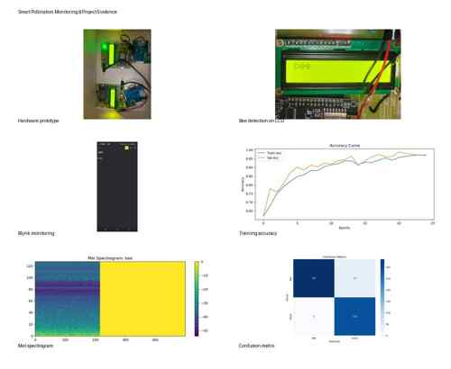

# Smart Pollination Monitoring System

AI + IoT + LoRa based bee-pollination monitoring project for identifying acoustic bee activity and reporting field observations remotely.

> **Project evidence:** This repository now includes a visual evidence board built from the supplied prototype/report images. See [`images/project-evidence.jpg`](images/project-evidence.jpg).

## Project purpose

Pollinating insects are important to crop production, but direct continuous observation of bee activity over a field is difficult. This project uses acoustic sensing as a practical way to monitor activity around a selected observation point. An INMP441 MEMS microphone captures environmental sound, an ESP32 provides the embedded acquisition/control layer, and an SX1278 LoRa link transports compact classification data to a receiver. A CNN-based audio classifier separates **Bee Activity** from **Background Noise**.

The project is designed as a complete sensing-to-monitoring pipeline rather than as a standalone machine-learning notebook:

**Acoustic sensing → preprocessing → Mel-spectrogram → CNN classification → LoRa transmission → receiver/gateway → Blynk monitoring**

## Main objectives

- Continuously observe acoustic activity associated with bees.
- Reduce the effect of environmental/background noise on classification.
- Convert audio into a fixed-size Mel-spectrogram representation.
- Classify the representation with a three-stage CNN.
- Communicate classification information through an SX1278 LoRa link.
- Provide a remote monitoring interface through Blynk.
- Keep the system modular so sensing, AI, radio and monitoring can be developed and tested independently.

## End-to-end architecture

```text
                  FIELD / APIARY
                       │
                       ▼
              ┌─────────────────┐
              │ INMP441         │
              │ MEMS microphone │
              └────────┬────────┘
                       │ I2S audio
                       ▼
              ┌─────────────────┐
              │ ESP32 node      │
              │ acquisition     │
              └────────┬────────┘
                       │ audio data
                       ▼
              ┌─────────────────┐
              │ Preprocessing   │
              │ noise reduction │
              └────────┬────────┘
                       ▼
              ┌─────────────────┐
              │ Mel-spectrogram │
              │ 128 × 128       │
              └────────┬────────┘
                       ▼
              ┌─────────────────┐
              │ 3-stage CNN     │
              └────────┬────────┘
                       ▼
          ┌──────────────────────────┐
          │ Bee Activity /           │
          │ Background Noise         │
          └────────────┬─────────────┘
                       │ class + confidence
                       ▼
              ┌─────────────────┐
              │ SX1278 LoRa TX  │
              └────────┬────────┘
                       │ LoRa
                       ▼
              ┌─────────────────┐
              │ SX1278 LoRa RX  │
              │ ESP32 receiver  │
              └────────┬────────┘
                       │
                       ▼
              ┌─────────────────┐
              │ Monitoring layer│
              │ / Blynk         │
              └─────────────────┘
```

### Processing responsibilities

| Layer | Responsibility |
|---|---|
| INMP441 | Capture digital acoustic signal |
| ESP32 | Embedded acquisition/control and LoRa node operation |
| Python preprocessing | Noise reduction and Mel-spectrogram generation |
| CNN | Classify bee activity versus background noise |
| SX1278 | Long-range wireless packet transport |
| Receiver/gateway | Receive and parse LoRa packets |
| Blynk | Remote visualization and monitoring |

The repository does not claim that the CNN is running natively on the ESP32 unless an embedded deployment of the trained model is separately added and validated. The supplied Python pipeline is the reference training/inference implementation.

## Project evidence

The supplied project materials contain prototype photographs and result figures. A compact, repository-friendly board is included here so visitors can see the physical implementation and software outputs without downloading the academic report.



**Shown in the board:** hardware prototype, LCD bee-detection output, Blynk monitoring, training-accuracy curve, Mel-spectrogram and confusion matrix.

For context on how these artifacts relate to the system, see [`documentation/project-materials.md`](documentation/project-materials.md).

> **Evidence policy:** screenshots and plots are preserved as project artifacts. They are not presented as independently reproduced benchmarks. Final performance claims should be tied to a documented dataset, split, model version and test conditions.

## AI model

### Input representation

The preprocessing pipeline uses:

- Mono audio
- Target sample rate: **16 kHz**
- Mel bands: **128**
- Frequency range: **50 Hz to Nyquist frequency**
- Log-power conversion using decibels
- Fixed representation: **128 × 128**

The preprocessing stage performs amplitude normalization and deterministic spectral noise-profile subtraction before Mel-spectrogram generation.

### CNN architecture

The training implementation contains three convolutional stages:

1. `Conv2D(16, 3×3)` + ReLU + max pooling
2. `Conv2D(32, 3×3)` + ReLU + max pooling
3. `Conv2D(64, 3×3)` + ReLU + max pooling
4. Global average pooling
5. Dense layer with 64 units and ReLU
6. Dropout of 0.30
7. Two-unit softmax output

The output classes are:

```text
0 = Background Noise
1 = Bee Activity
```

### Training configuration

The implementation uses:

- Stratified 80/20 train-validation split
- Random seed: 42
- Optimizer: Adam
- Loss: sparse categorical cross-entropy
- Default epochs: 25
- Default batch size: 32
- Shuffling during training

Accuracy values are generated by the actual training run. No accuracy, precision, recall or F1 value is hard-coded into this repository.

## Dataset

The project uses two acoustic classes:

```text
Bee Activity/
Background Noise/
```

The repository intentionally does not include a fabricated dataset. Put the recordings that you actually collected or are licensed to use under a local dataset directory. See `ai_model/dataset_info.md` for the required structure and recording metadata.

## Hardware

The documented hardware is:

- ESP32 development board
- INMP441 digital MEMS microphone
- SX1278 LoRa transceiver module
- Regulated power supply appropriate for the selected ESP32 and SX1278 boards
- Interconnects and an enclosure suitable for field deployment

### Hardware principle

The INMP441 supplies digital audio to the ESP32 through I2S. The ESP32 node is responsible for acquisition and communication. Classification data is transported using the SX1278 LoRa radio. A second SX1278-equipped ESP32 acts as the receiving node.

Exact GPIO values are **not stated as universal facts** because they depend on the ESP32 board variant and the wiring used in the physical prototype. Confirm the wiring against the actual prototype before flashing firmware.

## LoRa packet

The firmware uses a structured application payload:

```text
BEEWATCH,<class>,<confidence>,<node_id>,<sequence>
```

The receiver validates the packet prefix, extracts the fields, and reports the received values through the serial monitor. Confidence is represented as a decimal value between 0 and 1 by the application layer.

## Blynk monitoring

The Blynk layer is documented separately in `blynk/`. The dashboard is intended to expose the information that is useful during a field deployment, including:

- Latest bee/background classification
- Classification confidence
- Packet sequence
- Node identifier
- Last update status
- Received signal information when supplied by the receiver
- Activity history/trend when historical storage is enabled

Blynk authentication tokens and Wi-Fi credentials must remain outside Git. Use the local configuration procedure in `blynk/configuration/blynk_setup.md`.

## Repository structure

```text
smart-pollination-monitoring/
├── README.md
├── LICENSE
├── .gitignore
├── requirements.txt
├── hardware/
│   ├── README.md
│   ├── components/
│   │   └── components_list.md
│   └── circuit/
│       └── connection_guide.md
├── firmware/
│   ├── README.md
│   ├── esp32_transmitter/
│   │   ├── README.md
│   │   └── transmitter.ino
│   └── esp32_receiver/
│       ├── README.md
│       └── receiver.ino
├── ai_model/
│   ├── README.md
│   ├── dataset_info.md
│   ├── preprocessing/
│   │   ├── README.md
│   │   └── preprocessing.py
│   ├── training/
│   │   ├── README.md
│   │   └── train.py
│   ├── inference/
│   │   ├── README.md
│   │   └── inference.py
│   └── model/
│       └── README.md
├── blynk/
│   ├── README.md
│   ├── configuration/
│   │   └── blynk_setup.md
│   └── dashboard/
│       └── README.md
├── documentation/
│   ├── README.md
│   ├── project-materials.md
│   └── references.md
└── images/
    ├── README.md
    └── project-evidence.jpg
```

## Software setup

Python 3.10+ is recommended for the training/inference environment. Create a virtual environment and install the pinned minimum dependencies listed in `requirements.txt`.

```bash
python -m venv .venv
```

Windows:

```bash
.venv\Scripts\activate
```

Linux/macOS:

```bash
source .venv/bin/activate
```

Install:

```bash
pip install -r requirements.txt
```

## Preprocess the actual dataset

```bash
python ai_model/preprocessing/preprocessing.py --input-dir "data/dataset" --output-dir "data/processed"
```

The script creates one `.npy` Mel-spectrogram per supported audio recording and preserves the two class directories.

## Train the CNN

```bash
python ai_model/training/train.py --data-dir "data/processed" --output "ai_model/model/beewatch_cnn.keras"
```

The trained model and class list are generated by the training run. Model binaries are excluded from normal source control by `.gitignore` unless deliberately force-added.

## Run inference on a real recording

```bash
python ai_model/inference/inference.py --model "ai_model/model/beewatch_cnn.keras" --input "path/to/recording.wav"
```

The inference program performs the same preprocessing used by the model and reports the predicted class and confidence.

## Firmware preparation

Open the required sketch in Arduino IDE or PlatformIO, install the ESP32 board support package and the SX1278/LoRa library used by the sketch, then verify the GPIO definitions against the actual hardware.

### Transmitter

`firmware/esp32_transmitter/transmitter.ino` provides the LoRa transmission side. The node identifier, radio frequency and SPI/control pins are configuration parameters and must match the hardware.

### Receiver

`firmware/esp32_receiver/receiver.ino` provides the LoRa reception and packet parsing side. The receiver should use the same LoRa frequency and radio wiring as the transmitter.

## Field deployment sequence

1. Mount the INMP441 at the observation location.
2. Connect the microphone to the ESP32 I2S interface.
3. Power the sensor node using a stable supply.
4. Capture representative recordings under real field conditions.
5. Label recordings as bee activity or background noise.
6. Preprocess the recordings using the repository pipeline.
7. Train and validate the CNN using the actual dataset.
8. Evaluate the model on recordings not used for training.
9. Configure the LoRa transmitter and receiver with matching radio settings.
10. Configure Blynk with the user's actual template/datastream settings.
11. Deploy the nodes and monitor packet reception and classification behaviour.

## What is deliberately not fabricated

This repository contains real source-code implementations and project documentation, but it does not invent experimental facts. In particular, it does not state an unverified:

- Dataset size
- Dataset source
- Training accuracy
- Validation accuracy
- Precision/recall/F1 score
- LoRa range
- Battery life
- Field detection rate
- GPIO wiring that has not been confirmed
- Blynk template ID, token or Wi-Fi password
- Trained model weights that have not actually been produced

When these values are measured, replace the relevant documentation with the measured result and record the experiment conditions.

## Project documentation

- `hardware/README.md` — hardware role and deployment notes
- `hardware/components/components_list.md` — component-level bill of materials
- `hardware/circuit/connection_guide.md` — connection and electrical checks
- `ai_model/dataset_info.md` — dataset organization and labeling
- `ai_model/preprocessing/preprocessing.py` — audio preprocessing implementation
- `ai_model/training/train.py` — CNN training implementation
- `ai_model/inference/inference.py` — single-file inference implementation
- `firmware/` — ESP32 LoRa transmitter/receiver firmware
- `blynk/` — dashboard and configuration documentation
- `documentation/project-materials.md` — supplied report/image evidence and attribution notes
- `documentation/` — project documentation and references
- `images/project-evidence.jpg` — visual evidence board assembled from supplied project images

## License

MIT License. See `LICENSE`.
